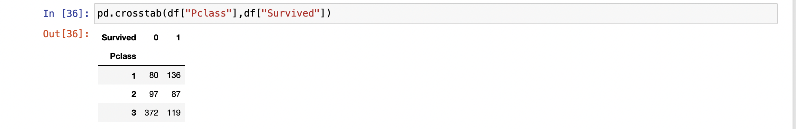

# Ex-03EDA

## AIM
To perform EDA on the given data set. 

# Explanation
The primary aim with exploratory analysis is to examine the data for distribution, outliers and 
anomalies to direct specific testing of your hypothesis.
 

# ALGORITHM
### STEP 1
Import the required packages(pandas,numpy,seaborn).
### STEP 2
Read and Load the Dataset.
### STEP 3
Remove the null values from the data and remove the outliers.
### STEP 4
Remove the non numerical data columns using drop() method.
### STEP 5: 
returns object containing counts of unique values using (value_counts()). 
### STEP 6: 
Plot the counts in the form of Histogram or Bar Graph.
### STEP 7: 
find the pairwise correlation of all columns in the dataframe(.corr()).
### STEP 8: 
Save the final data set into the file.

# CODE
```
import pandas as pd
import numpy as np
import seaborn as sns
df=pd.read_csv("titanic_dataset.csv")
df.info()
```
```
df.head()
```
```
df.drop("Cabin",axis=1,inplace=True)
df.info()
```
```
df.isnull().sum()
```
```
df['Age']=df["Age"].fillna(df["Age"]).median()
df.boxplot()
```
```
df["Embarked"] = df["Embarked"].fillna(df["Embarked"].mode())
df.boxplot()
```
```
df.isnull().sum()
```
```
df["Embarked"].value_counts()
```
```
df["Pclass"].value_counts()
```
```
df["Survived"].value_counts()
```
```
sns.countplot(x="Survived",data=df)
```
```
sns.countplot(x="Pclass",data=df)
```
```
sns.countplot(x = "Sex",data=df)
```
```
df.info()
```
```
sns.displot(df["Fare"])
```
```
sns.countplot(x="Pclass",hue="Survived",data=df)
```
```
sns.countplot(x="Sex",hue="Survived",data=df)
```
```
sns.displot(df[df["Survived"]==0]["Age"])
```
```
sns.displot(df[df["Survived"]==1]["Age"])
```
```
pd.crosstab(df["Pclass"],df["Survived"])
```
```
pd.crosstab(df["Sex"],df["Survived"])
```
```
df.corr()
```
```
sns.heatmap(df.corr(),annot=True)
```
# OUtPUT





